# Spec Canvas

**Turn a codebase or an idea into clear documentation and real diagrams.**

A portable agent skill for Claude Code, Codex, and other file-capable agents. Works
with C, C++, Python, Rust, Java, TypeScript, monoliths, services, and mixed repositories.
Your agent reads the project; Spec Canvas supplies the writing workflow, templates,
and optional deterministic rendering tools.

**White background by default. Node.js optional. No third-party runtime dependencies.**

## Start without Node.js

1. [Download the skill ZIP](https://github.com/blabbler78/spec-canvas/releases/latest/download/spec-canvas-skill.zip), or download this repository as a ZIP.
2. Copy the `spec-canvas` skill folder into your project:
   - Claude Code: `.claude/skills/spec-canvas/`
   - Codex: `.agents/skills/spec-canvas/`
   - Both: copy it to both directories.
3. Reload your agent's skill discovery, then ask it to document something:

**Claude Code**

```text
/spec-canvas Document how this project handles background jobs.
Include confirmed behavior, unknowns, code links, and a sequence diagram.
```

**Codex**

```text
$spec-canvas Document how this project handles background jobs.
Include confirmed behavior, unknowns, code links, and a sequence diagram.
```

For another agent, add the skill folder to its supported skill directory or ask it
to read `SKILL.md` directly. Automated installation targets Claude Code and Codex;
other integrations are manual and depend on that agent's capabilities.

**No Node.js is needed for the agent to write Markdown and HTML/SVG.** The included
scripts are optional. You still need an existing agent with project/file access;
this package does not provide a model, API subscription, or autonomous AI runtime.

## Optional guided installer

With Node.js 20+ and pnpm:

```sh
pnpm dlx github:blabbler78/spec-canvas#v0.1.1 init
```

Or clone the repository and run `node bin/spec-canvas.mjs init --project /path/to/project`.
No `pnpm install` is needed: the CLI has no external dependencies.

The installer asks only:

```text
Install for Claude, Codex, or both? [both]
Documentation directory? [.ai/specs]
```

Press Enter twice to accept the defaults. For automation:

```sh
node bin/spec-canvas.mjs init --project /path/to/project --agent both --yes
```

It copies the full skill, scripts, references and assets into the selected agent
directories, creates a project-local Markdown template and `.spec-canvas.json`, and
creates the output folder. It refuses to overwrite an existing installation. It does
not modify your application package manifest, build system or agent configuration.
Node.js stays a documentation tool; your C++ or Python application need not use it.

## What you can generate

| View | Use it to explain |
| --- | --- |
| Flow | Steps, conditions and outcomes |
| Sequence | Who calls whom, and when |
| State | One entity's lifecycle, guards and retries |
| Architecture | Components and their relationships |
| Dependency | Prerequisites and what they enable |

Use multiple views for a fuller explanation. The optional CLI handles simple graph
and sequence layouts; your agent can author richer SVG diagrams manually. Before/after
comparisons combine two matching views. PNG/PDF export needs a separate browser/tool;
PPTX, Mermaid and AI image generation are not bundled in this initial release.

## See the difference

Synthetic job-service examples in English. Light is the default; dark is opt-in.
Open a downloaded HTML file locally to explore the full-size diagram.

| Flow — light | Flow — dark |
| --- | --- |
| 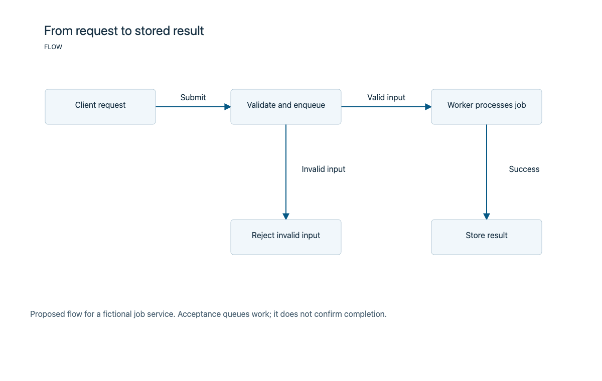 | 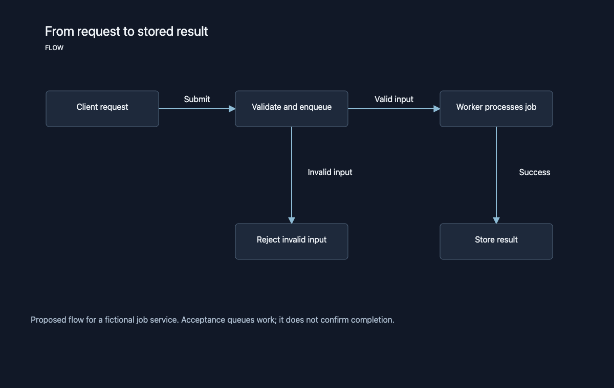 |

| Sequence — light | Sequence — dark |
| --- | --- |
| 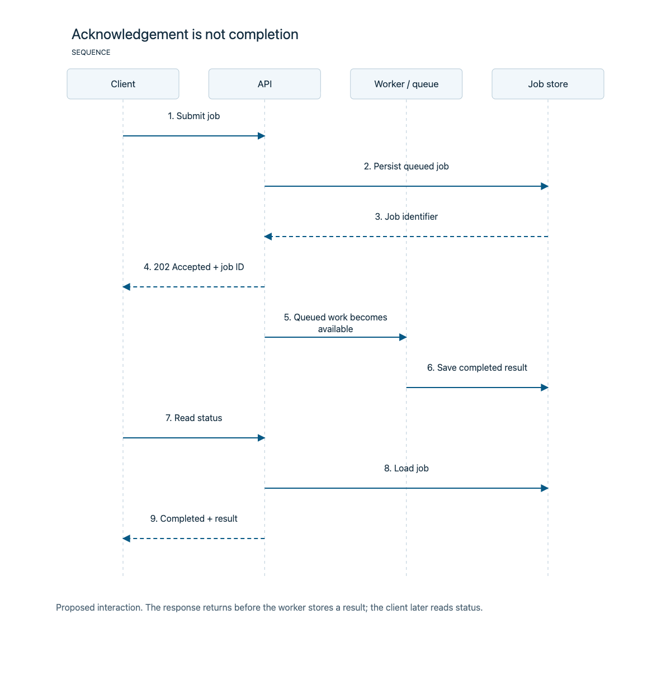 | 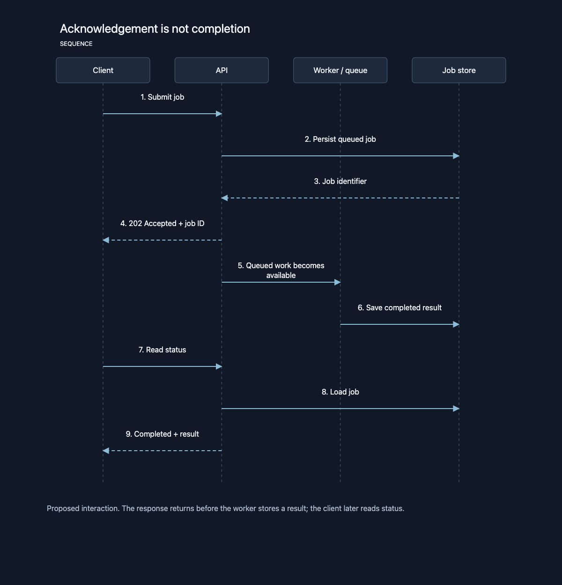 |

| States — light | States — dark |
| --- | --- |
| 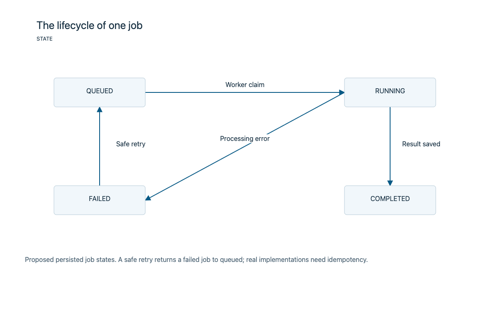 | 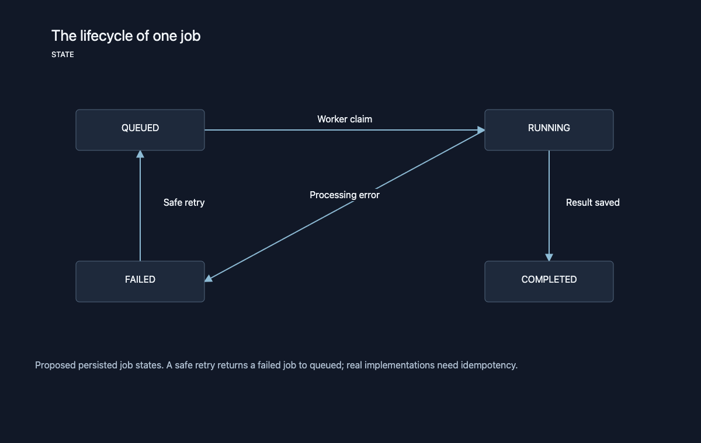 |

| Architecture — light | Dependencies — dark |
| --- | --- |
| 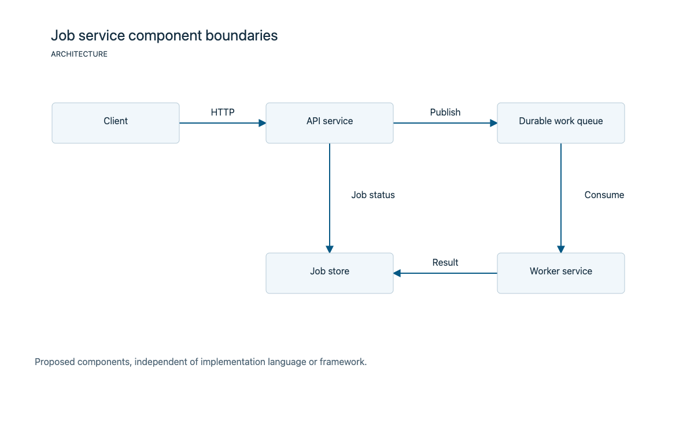 | 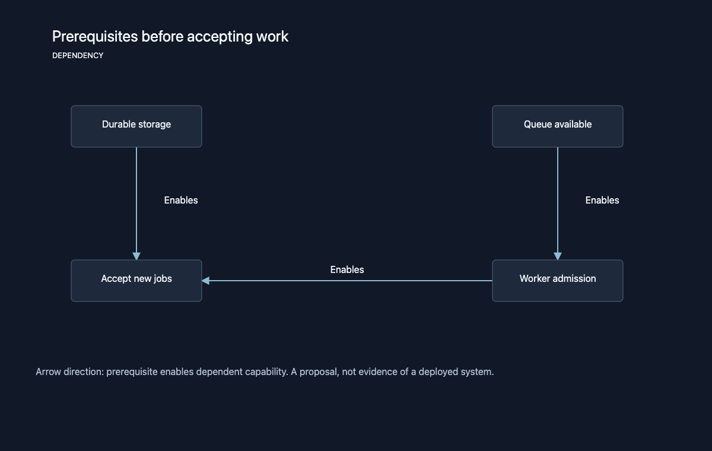 |

[All five views, both themes](examples/index.html) · [Complete example: Markdown](examples/full-document.md) · [Complete example: HTML](examples/full-document.html)

GitHub displays Markdown and screenshots; it shows HTML as source. Download the
repository to open the HTML examples in your browser.

## Rich presentation mode

Beyond the simple CLI diagrams, your agent can create a complete visual explanation
using the bundled overview/cards, editorial or blueprint page templates. This
manual path needs no Node.js. Typography, evidence panels, diagrams and prose form
one document; custom project templates can replace the defaults.

Use overview/cards for a compact system brief or review handoff, editorial for
long-form reading, and blueprint for an explicitly dark technical treatment.

| Overview cards — white | Overview cards — dark |
| --- | --- |
| 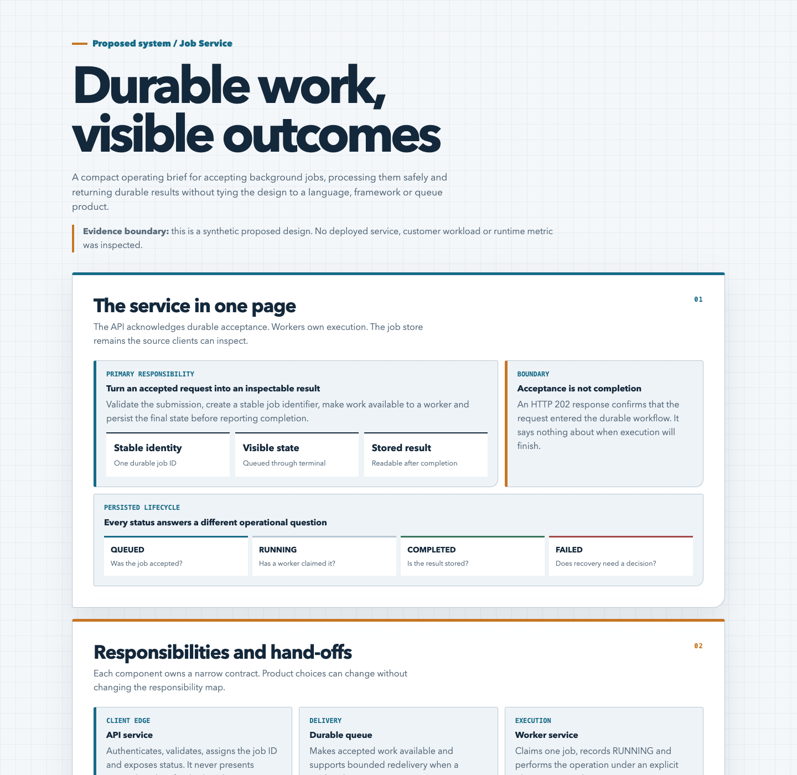 | 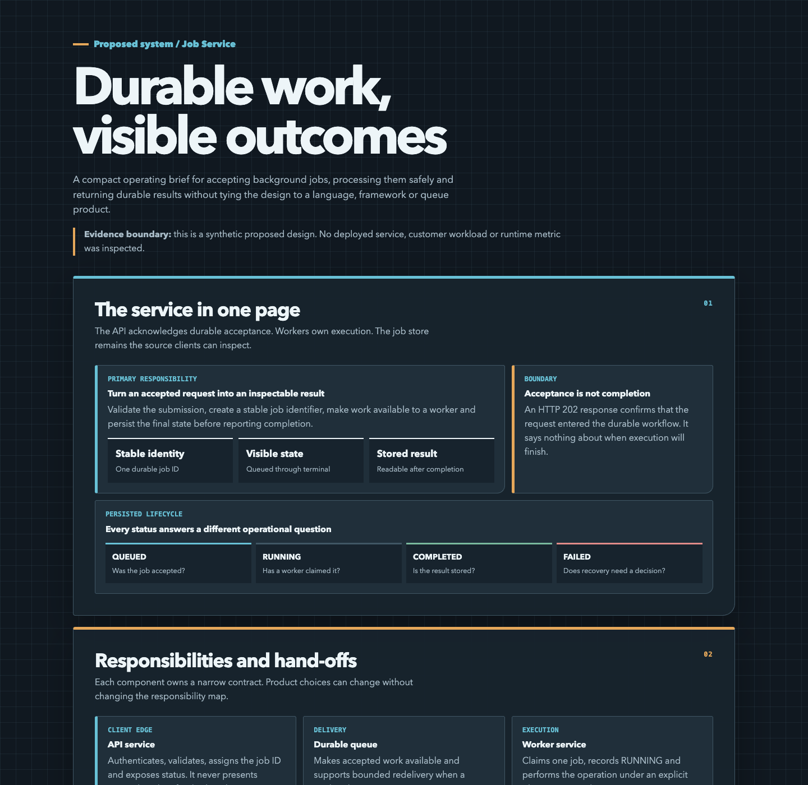 |

[Overview HTML — white](examples/overview-document-light.html) · [Overview HTML — dark](examples/overview-document-dark.html)

| Editorial — white | Blueprint — dark |
| --- | --- |
| 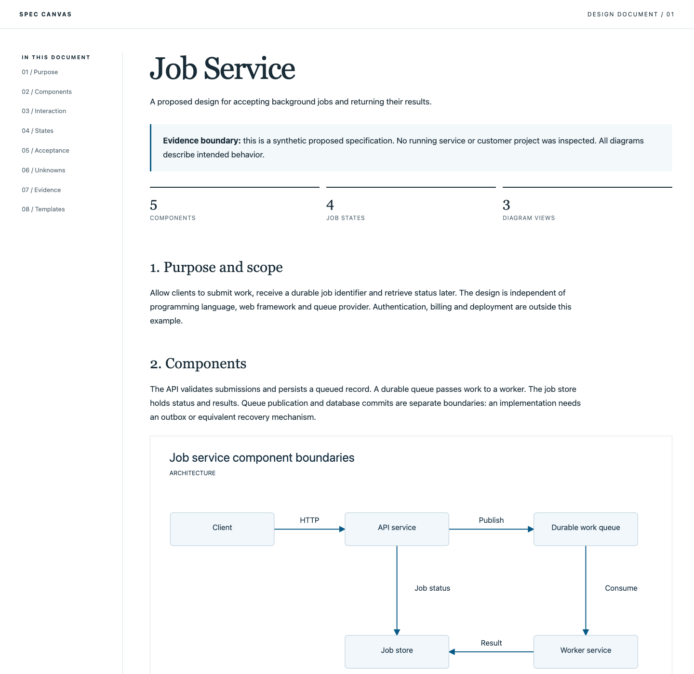 | 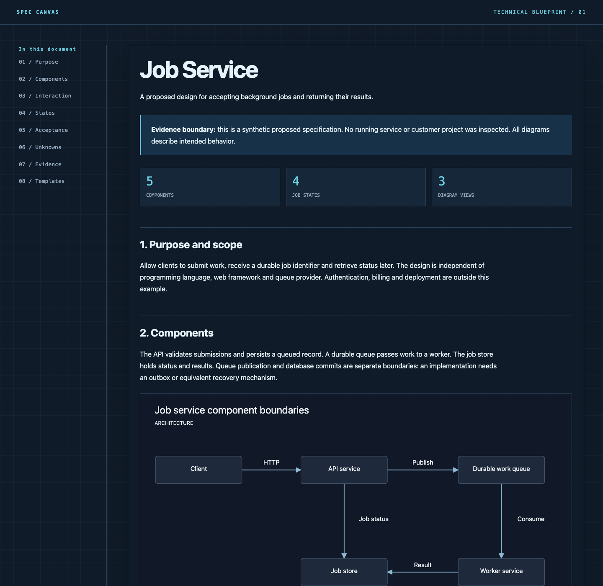 |

[Editorial HTML](examples/editorial-document.html) · [Blueprint HTML](examples/blueprint-document.html)

These are original templates, not a bundled copy of visual-explainer. That separate
skill provides broader presentation guidance and optional integrations; see the
[optional tools guide](docs/optional-tools.md).

## A complete document

The included fictional Job Service specification combines narrative, architecture,
sequence, state transitions, acceptance criteria, unknowns and evidence boundaries.
It is a **proposed design**, not an assertion about a deployed application.

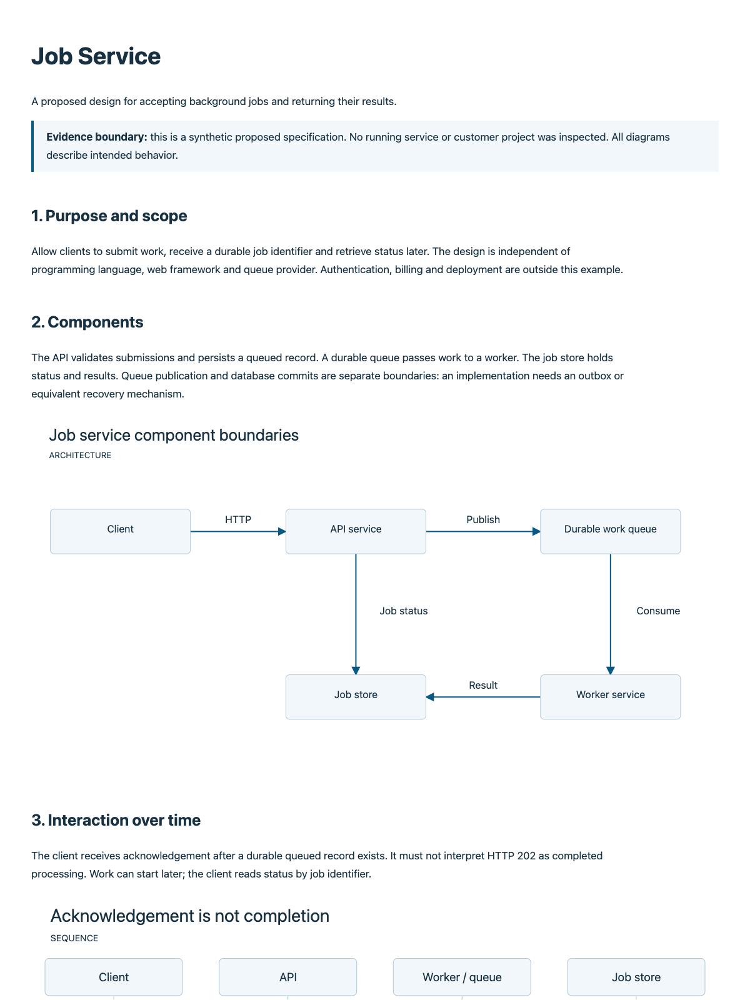

## Bring your own template

The installer creates `.spec-canvas/templates/spec.md`. Edit it to match your team's
format, or add another Markdown file and set `documentTemplate` in `.spec-canvas.json`:

```json
{
  "version": 1,
  "outputDirectory": ".ai/specs",
  "documentTemplate": "docs/templates/team-spec.md",
  "theme": "light",
  "language": "en"
}
```

The agent reads the template and fills its sections with evidence. The optional
`scaffold` command replaces `{{title}}` and `{{date}}`; it does not invent the content.
[Default template](skills/spec-canvas/assets/spec.md) · [Customization guide](docs/templates.md).

## Optional CLI

```sh
# Deterministic rendering of agent-prepared JSON
node bin/spec-canvas.mjs render --input examples/state-light.json --output demo/state.html
node bin/spec-canvas.mjs check --meta demo/state.meta.json

# Start a document using your own template
node bin/spec-canvas.mjs scaffold --title "Storage design" \
  --template skills/spec-canvas/assets/spec.md --output demo/storage.md

# Inspect installation readiness
node bin/spec-canvas.mjs doctor
```

After installation, use `.agents/skills/spec-canvas/scripts/cli.mjs` or the equivalent
`.claude` path. Paths are relative to your project. Use `--project` to target another
project. Existing files are protected; `render` and `scaffold` accept explicit
`--force` for intentional replacement. Render writes HTML, SVG and hash metadata.
`check` validates input/output freshness, not source correctness or visual quality.

## Tools, licenses and ownership

Our code and documentation are **MIT licensed**. The package has no third-party
runtime dependencies. The design draws inspiration from Nico Bailon's original
visual-explainer; we do not bundle its code, a fork, or its dependency tree.
[Tools and attribution](THIRD_PARTY_NOTICES.md) documents required and optional tools.
[Using visual-explainer and Mermaid alongside this skill](docs/optional-tools.md)
explains how existing tools can complement the workflow without mandatory installs.
Models, agents and browsers are separately obtained and follow their own terms.

Contributions through issues and pull requests are welcome. **@blabbler78 is the
sole maintainer and code owner**, and only the owner accepts changes or makes releases.
See [CONTRIBUTING.md](CONTRIBUTING.md). MIT allows independent forks; maintainer control
applies to this repository.

## Development and verification

```sh
node --test
node scripts/examples.mjs
```

No dependency installation or application server is needed. [Verification](docs/verification.md)
records checks and limits for the initial release. See [installation details](docs/installation.md)
for manual installation, updates, removal and platform notes.
