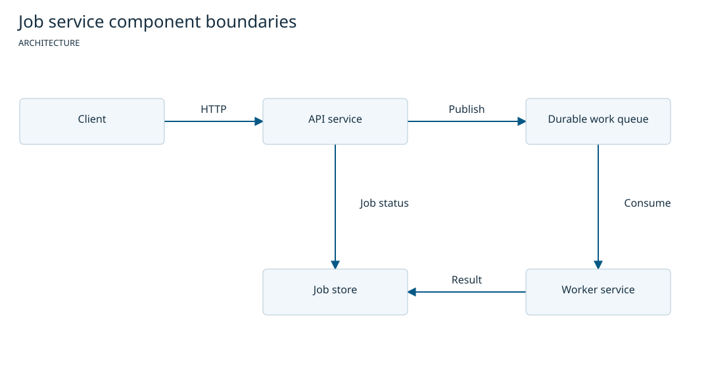
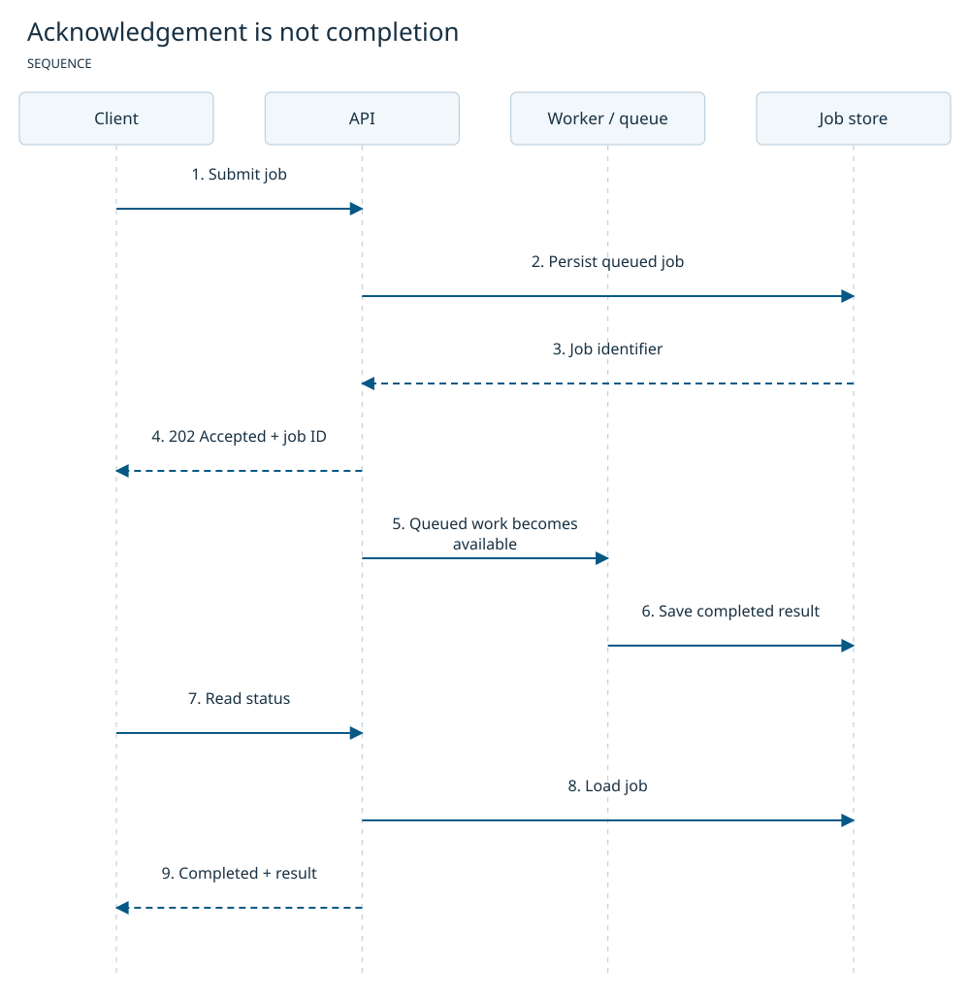
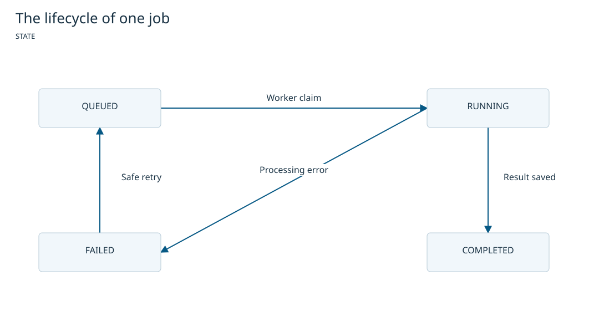

# Job Service — proposed system specification

Mode: proposed solution. Synthetic example, not a deployed customer project.

## Purpose and scope

Accept background jobs, return durable identifiers and allow clients to retrieve
status later. This design is independent of programming language, framework and
queue provider. Authentication, billing and deployment are outside the example.

## Evidence boundary

No running service or repository implementation was inspected for this fictional
system. These are intended behaviors. Diagram inputs are supplied example JSON,
not inferred implementation facts. Release tooling verification is recorded
separately in [verification](../docs/verification.md).

## Components

An API validates requests and persists a queued job. A durable queue passes work
to a worker. A job store holds states and results. Queue publication and DB commit
are separate boundaries; implementation needs an outbox or equivalent recovery.

## Interaction over time

The client receives acknowledgement after a queued record is persisted. HTTP 202
means accepted work, not completion. Processing happens later. The client reads
status by the stable job identifier.

## States and failures

Only a claim moves QUEUED to RUNNING. The result is stored before COMPLETED. Failure
produces FAILED. Retry requires a defined idempotency policy and must be safe for
any side effects; this graph does not provide an exactly-once guarantee.

## Acceptance criteria

- Accepted requests return a stable job identifier.
- Invalid requests do not create runnable work.
- Status distinguishes queued, running, completed and failed.
- Duplicate submissions and retries do not repeat protected side effects.
- A completed result is retrievable by identifier.

## Unknowns

| Decision | Consequence |
| --- | --- |
| Queue/store technology | Determines publication/recovery strategy |
| Retry bounds and idempotency keys | Determines safe repeated processing |
| Authorization, tenancy and retention | Determines access and privacy constraints |

## Diagram sources

[Architecture input](architecture-light.json), [sequence input](sequence-light.json),
[state input](state-light.json). [HTML version with text and inline diagrams](full-document.html).

## Template

This example follows the bundled [default template](../skills/spec-canvas/assets/spec.md),
adapted for a proposal. It can be replaced with a project-local team template.
